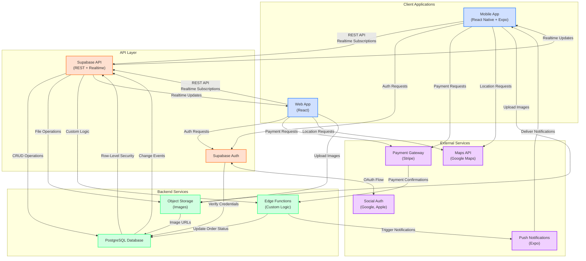

# HarvestLink System Architecture Diagram

Below is the system architecture diagram for the HarvestLink MVP, showing all key components and data flows.

## Architecture Components

### Client Applications
- **Mobile App**: React Native with Expo for iOS and Android platforms
- **Web App**: React-based web application for desktop browsers

### API Layer
- **Supabase API**: Provides REST endpoints and realtime subscriptions
- **Supabase Auth**: Handles authentication and authorization

### Backend Services
- **PostgreSQL Database**: Stores all application data with row-level security
- **Object Storage**: Stores and serves images (farm photos, product images, user avatars)
- **Edge Functions**: Custom serverless functions for complex business logic

### External Services
- **Payment Gateway (Stripe)**: Processes payments for orders
- **Push Notifications (Expo)**: Delivers notifications to mobile devices
- **Maps API (Google Maps)**: Provides location services and mapping
- **Social Auth Providers**: Enables login with Google, Apple, etc.

## Data Flows

### Authentication Flow
1. Users authenticate via the mobile or web app
2. Authentication requests are handled by Supabase Auth
3. Credentials are verified against the PostgreSQL database
4. For social logins, OAuth flow is handled with external providers
5. JWT tokens are issued to authenticated clients

### Order Processing Flow
1. Consumers browse farms and products
2. Items are added to cart and checkout is initiated
3. Payment information is sent to payment gateway
4. Payment confirmations trigger updates via edge functions
5. Order status is updated in the database
6. Realtime updates are pushed to both consumer and producer apps
7. Notifications are sent to relevant parties

### Image Handling Flow
1. Users upload images from mobile or web apps
2. Images are stored in object storage
3. Image URLs are saved in the database
4. Images are served to clients when needed

### Realtime Updates Flow
1. Database changes trigger events
2. Events are propagated through Supabase realtime API
3. Client applications receive updates and refresh UI accordingly

## Security Considerations

- **Authentication**: JWT-based authentication with secure token storage
- **Authorization**: Row-level security policies in PostgreSQL
- **Data Protection**: HTTPS for all communications
- **Payment Security**: PCI-compliant payment processing via Stripe