# The Trash Panda Data Flow Diagram

This diagram illustrates the key data flows within the The Trash Panda application, showing how information moves between users, components, and systems.

```mermaid
flowchart TD
    %% External Actors
    Consumer[Consumer]
    Producer[Producer]
    
    %% Client Applications
    MobileApp[Mobile Application]
    WebApp[Web Application]
    
    %% Core Processes
    Auth[Authentication Process]
    FarmDiscovery[Farm Discovery Process]
    Ordering[Ordering Process]
    Inventory[Inventory Management]
    Messaging[Messaging System]
    Payments[Payment Processing]
    Notifications[Notification System]
    
    %% Data Stores
    UserDB[(User Database)]
    FarmDB[(Farm Database)]
    ProductDB[(Product Database)]
    OrderDB[(Order Database)]
    MessageDB[(Message Database)]
    ImageStore[(Image Storage)]
    
    %% External Systems
    PaymentGateway[Payment Gateway]
    PushService[Push Notification Service]
    MapsService[Maps Service]
    
    %% Consumer Flows
    Consumer -->|"Register/Login"| MobileApp
    Consumer -->|"Register/Login"| WebApp
    MobileApp -->|"Authentication Request"| Auth
    WebApp -->|"Authentication Request"| Auth
    Auth -->|"Store User Data"| UserDB
    Auth -->|"Return JWT Token"| MobileApp
    Auth -->|"Return JWT Token"| WebApp
    
    Consumer -->|"Search for Farms"| MobileApp
    MobileApp -->|"Query Farms"| FarmDiscovery
    FarmDiscovery -->|"Retrieve Farm Data"| FarmDB
    FarmDiscovery -->|"Retrieve Product Data"| ProductDB
    FarmDiscovery -->|"Return Results"| MobileApp
    MobileApp -->|"Display Farms/Products"| Consumer
    
    Consumer -->|"Place Order"| MobileApp
    MobileApp -->|"Create Order"| Ordering
    Ordering -->|"Store Order"| OrderDB
    Ordering -->|"Process Payment"| Payments
    Payments -->|"Payment Request"| PaymentGateway
    PaymentGateway -->|"Payment Confirmation"| Payments
    Payments -->|"Update Order Status"| OrderDB
    Ordering -->|"Notify Producer"| Notifications
    Notifications -->|"Send Push Notification"| PushService
    PushService -->|"Deliver Notification"| Producer
    
    Consumer -->|"Send Message"| MobileApp
    MobileApp -->|"Store Message"| Messaging
    Messaging -->|"Save Message"| MessageDB
    Messaging -->|"Notify Recipient"| Notifications
    
    %% Producer Flows
    Producer -->|"Register/Login"| MobileApp
    Producer -->|"Manage Farm Profile"| MobileApp
    MobileApp -->|"Update Farm Data"| FarmDB
    Producer -->|"Upload Farm Images"| MobileApp
    MobileApp -->|"Store Images"| ImageStore
    ImageStore -->|"Return Image URLs"| MobileApp
    MobileApp -->|"Update Farm with Image URLs"| FarmDB
    
    Producer -->|"Manage Products"| MobileApp
    MobileApp -->|"Create/Update Products"| Inventory
    Inventory -->|"Store Product Data"| ProductDB
    Producer -->|"Upload Product Images"| MobileApp
    MobileApp -->|"Store Images"| ImageStore
    ImageStore -->|"Return Image URLs"| MobileApp
    MobileApp -->|"Update Products with Image URLs"| ProductDB
    
    Producer -->|"View Orders"| MobileApp
    MobileApp -->|"Retrieve Orders"| OrderDB
    OrderDB -->|"Return Order Data"| MobileApp
    MobileApp -->|"Display Orders"| Producer
    Producer -->|"Update Order Status"| MobileApp
    MobileApp -->|"Update Order"| OrderDB
    OrderDB -->|"Trigger Notification"| Notifications
    Notifications -->|"Notify Consumer"| Consumer
    
    %% Location Services
    Consumer -->|"Search by Location"| MobileApp
    MobileApp -->|"Location Query"| MapsService
    MapsService -->|"Return Location Data"| MobileApp
    MobileApp -->|"Filter Farms by Location"| FarmDiscovery
    
    %% Realtime Updates
    OrderDB -->|"Order Status Change"| MobileApp
    MessageDB -->|"New Message"| MobileApp
    ProductDB -->|"Inventory Update"| MobileApp
    
    %% Offline Sync
    MobileApp -->|"Cache Data"| MobileApp
    MobileApp -->|"Sync when Online"| FarmDB
    MobileApp -->|"Sync when Online"| ProductDB
    MobileApp -->|"Sync when Online"| OrderDB
    
    %% Styling
    classDef actors fill:#f9d5e5,stroke:#eeac99,stroke-width:2px
    classDef applications fill:#d0e0ff,stroke:#3080ff,stroke-width:2px
    classDef processes fill:#eeeeee,stroke:#999999,stroke-width:2px
    classDef dataStores fill:#c7f0d8,stroke:#43aa8b,stroke-width:2px
    classDef externalSystems fill:#f0d0ff,stroke:#a030ff,stroke-width:2px
    
    class Consumer,Producer actors
    class MobileApp,WebApp applications
    class Auth,FarmDiscovery,Ordering,Inventory,Messaging,Payments,Notifications processes
    class UserDB,FarmDB,ProductDB,OrderDB,MessageDB,ImageStore dataStores
    class PaymentGateway,PushService,MapsService externalSystems
```

## Key Data Flows

### User Authentication Flow
1. User (Consumer or Producer) initiates login/registration
2. Client application sends credentials to Authentication Process
3. Authentication Process verifies credentials against User Database
4. JWT token returned to client application
5. Token stored securely on client device

### Farm Discovery Flow
1. Consumer searches for farms (by location, product, etc.)
2. Farm Discovery Process queries Farm and Product Databases
3. Results returned to client application
4. Consumer views farm profiles and available products

### Order Processing Flow
1. Consumer selects products and places order
2. Ordering Process creates order record in Order Database
3. Payment Processing handles transaction with Payment Gateway
4. Order status updated based on payment result
5. Notification sent to Producer about new order
6. Producer receives and processes order
7. Order status updates trigger notifications to Consumer

### Inventory Management Flow
1. Producer updates product information and inventory
2. Inventory Management Process updates Product Database
3. Changes propagated to consumers in real-time
4. Out-of-stock products automatically hidden from search results

### Messaging Flow
1. User sends message to another user
2. Message stored in Message Database
3. Recipient notified of new message
4. Messages linked to relevant orders or products when applicable

### Image Handling Flow
1. User uploads images (farm photos, product images, etc.)
2. Images stored in Image Storage
3. Image URLs saved in respective databases (Farm, Product, etc.)
4. Images served to clients when viewing related content

## Data Synchronization

### Realtime Updates
- Database changes trigger events through Supabase Realtime
- Client applications receive updates and refresh UI accordingly
- Critical updates (order status, messages) delivered as push notifications

### Offline Capabilities
- Client applications cache essential data locally
- Users can view previously loaded content offline
- Changes made offline queued for synchronization
- Data synchronized when connection restored

## Security Considerations

- All data flows protected by authentication and authorization
- Sensitive data (payment information) handled securely
- Row-level security ensures users only access appropriate data
- All communications encrypted using HTTPS