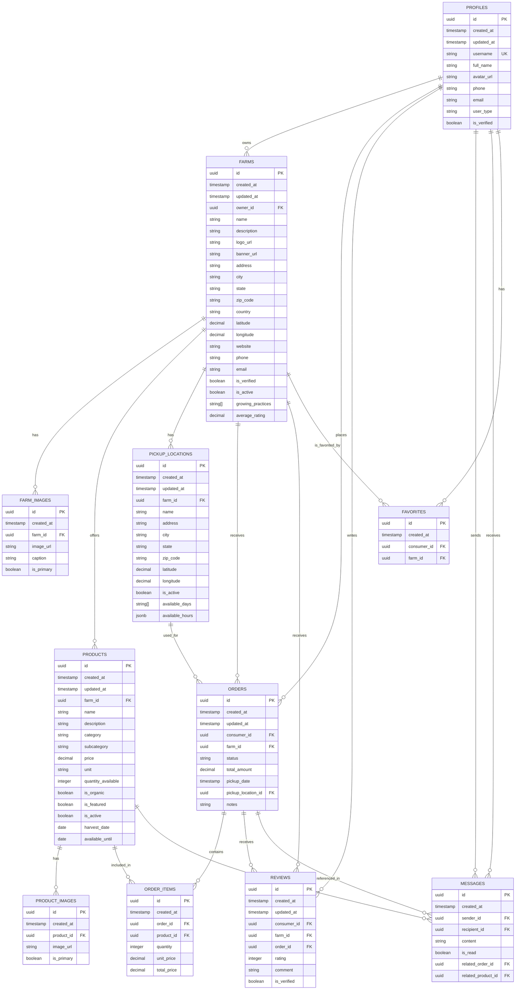

# The Trash Panda Database Schema Diagram

This diagram illustrates the database schema for the The Trash Panda application, showing tables, relationships, and key fields.

## Database Schema Details

### Core Tables

#### PROFILES
- Extends Supabase auth.users
- Stores user profile information
- Differentiates between consumer and producer users

#### FARMS
- Represents farm listings
- Owned by producer users
- Contains location and contact information
- Tracks verification status and active state

#### PRODUCTS
- Represents items for sale
- Belongs to a specific farm
- Tracks inventory, pricing, and availability

#### ORDERS
- Represents purchases made by consumers
- Links to specific farm and consumer
- Tracks status, payment, and pickup details

### Supporting Tables

#### FARM_IMAGES / PRODUCT_IMAGES
- Store image references for farms and products
- Support multiple images per entity
- Track primary images for display

#### PICKUP_LOCATIONS
- Defines where consumers can collect orders
- Belongs to a specific farm
- Includes address and availability information

#### ORDER_ITEMS
- Junction table for orders and products
- Tracks quantity and pricing at time of purchase

#### REVIEWS
- Stores consumer feedback on farms
- Links to specific orders for verified reviews
- Used to calculate farm ratings

#### MESSAGES
- Enables direct communication between users
- Can reference specific orders or products
- Tracks read status

#### FAVORITES
- Tracks consumer preferences for farms
- Enables quick access to preferred producers

## Key Relationships

- A user (PROFILE) can be either a consumer or producer
- Producers own FARMS, which offer PRODUCTS
- Consumers place ORDERS for PRODUCTS from FARMS
- ORDERS are fulfilled at PICKUP_LOCATIONS
- Consumers can leave REVIEWS for FARMS based on ORDERS
- Users can exchange MESSAGES about ORDERS or PRODUCTS
- Consumers can mark FARMS as FAVORITES

## Security Considerations

- Row-Level Security (RLS) policies control access to each table
- Producers can only manage their own farms and products
- Consumers can only view their own orders and messages
- Public data (farm listings, products) is readable by all users
- Sensitive data is protected by appropriate policies