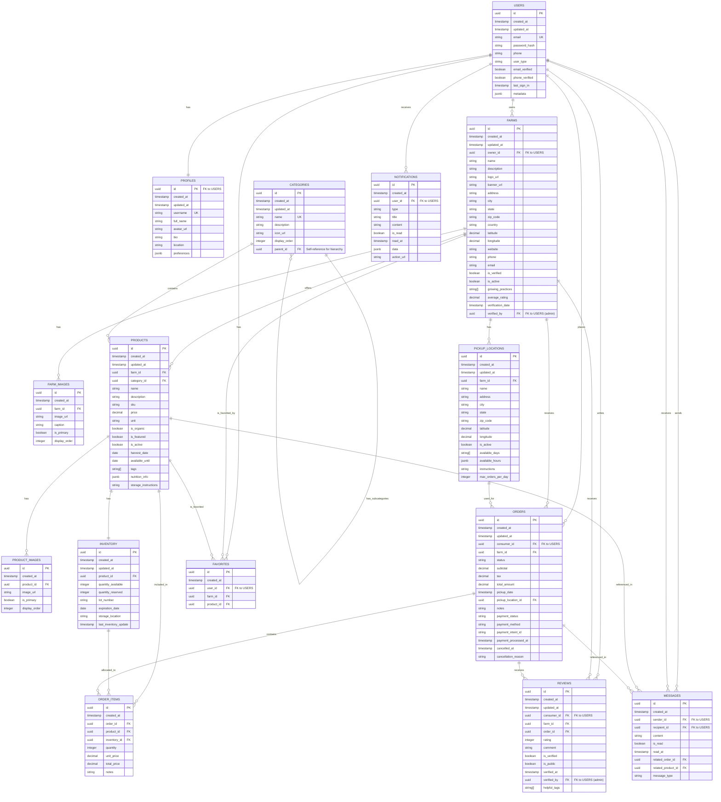

# HarvestLink Database Schema

This document outlines the comprehensive database schema for the HarvestLink MVP, including entity relationships, attributes, data types, and constraints.

## Entity-Relationship Diagram



## Table Definitions

### USERS

Stores authentication and basic user information.

| Column | Type | Constraints | Description |
|--------|------|-------------|-------------|
| id | UUID | PRIMARY KEY | Unique identifier |
| created_at | TIMESTAMP | NOT NULL, DEFAULT now() | Record creation timestamp |
| updated_at | TIMESTAMP | NOT NULL, DEFAULT now() | Record update timestamp |
| email | TEXT | UNIQUE, NOT NULL | User's email address |
| password_hash | TEXT | NOT NULL | Hashed password (managed by Supabase Auth) |
| phone | TEXT | | User's phone number |
| user_type | TEXT | NOT NULL, CHECK (user_type IN ('consumer', 'producer', 'admin')) | User role |
| email_verified | BOOLEAN | NOT NULL, DEFAULT false | Whether email is verified |
| phone_verified | BOOLEAN | NOT NULL, DEFAULT false | Whether phone is verified |
| last_sign_in | TIMESTAMP | | Last sign-in timestamp |
| metadata | JSONB | | Additional user metadata |

### PROFILES

Stores user profile information.

| Column | Type | Constraints | Description |
|--------|------|-------------|-------------|
| id | UUID | PRIMARY KEY, REFERENCES users(id) | User ID (1:1 with USERS) |
| created_at | TIMESTAMP | NOT NULL, DEFAULT now() | Record creation timestamp |
| updated_at | TIMESTAMP | NOT NULL, DEFAULT now() | Record update timestamp |
| username | TEXT | UNIQUE | User's chosen username |
| full_name | TEXT | | User's full name |
| avatar_url | TEXT | | URL to user's profile picture |
| bio | TEXT | | User's biography |
| location | TEXT | | User's general location |
| preferences | JSONB | | User preferences (notifications, privacy, etc.) |

### FARMS

Stores information about producer farms.

| Column | Type | Constraints | Description |
|--------|------|-------------|-------------|
| id | UUID | PRIMARY KEY | Unique identifier |
| created_at | TIMESTAMP | NOT NULL, DEFAULT now() | Record creation timestamp |
| updated_at | TIMESTAMP | NOT NULL, DEFAULT now() | Record update timestamp |
| owner_id | UUID | REFERENCES users(id), NOT NULL | Farm owner's user ID |
| name | TEXT | NOT NULL | Farm name |
| description | TEXT | | Farm description |
| logo_url | TEXT | | URL to farm logo |
| banner_url | TEXT | | URL to farm banner image |
| address | TEXT | | Farm address |
| city | TEXT | | Farm city |
| state | TEXT | | Farm state/province |
| zip_code | TEXT | | Farm postal code |
| country | TEXT | DEFAULT 'USA' | Farm country |
| latitude | DECIMAL(10, 8) | | Farm latitude for mapping |
| longitude | DECIMAL(11, 8) | | Farm longitude for mapping |
| website | TEXT | | Farm website URL |
| phone | TEXT | | Farm contact phone |
| email | TEXT | | Farm contact email |
| is_verified | BOOLEAN | DEFAULT false | Whether farm is verified |
| is_active | BOOLEAN | DEFAULT true | Whether farm is active |
| growing_practices | TEXT[] | | Array of growing practices (organic, sustainable, etc.) |
| average_rating | DECIMAL(3, 2) | DEFAULT 0 | Average rating from reviews |
| verification_date | TIMESTAMP | | When farm was verified |
| verified_by | UUID | REFERENCES users(id) | Admin who verified the farm |

### FARM_IMAGES

Stores images associated with farms.

| Column | Type | Constraints | Description |
|--------|------|-------------|-------------|
| id | UUID | PRIMARY KEY | Unique identifier |
| created_at | TIMESTAMP | NOT NULL, DEFAULT now() | Record creation timestamp |
| farm_id | UUID | REFERENCES farms(id), NOT NULL | Associated farm ID |
| image_url | TEXT | NOT NULL | URL to image |
| caption | TEXT | | Image caption |
| is_primary | BOOLEAN | DEFAULT false | Whether this is the primary image |
| display_order | INTEGER | DEFAULT 0 | Order for display |

### CATEGORIES

Stores product categories with hierarchical structure.

| Column | Type | Constraints | Description |
|--------|------|-------------|-------------|
| id | UUID | PRIMARY KEY | Unique identifier |
| created_at | TIMESTAMP | NOT NULL, DEFAULT now() | Record creation timestamp |
| updated_at | TIMESTAMP | NOT NULL, DEFAULT now() | Record update timestamp |
| name | TEXT | UNIQUE, NOT NULL | Category name |
| description | TEXT | | Category description |
| icon_url | TEXT | | URL to category icon |
| display_order | INTEGER | DEFAULT 0 | Order for display |
| parent_id | UUID | REFERENCES categories(id) | Parent category ID for hierarchy |

### PRODUCTS

Stores product information.

| Column | Type | Constraints | Description |
|--------|------|-------------|-------------|
| id | UUID | PRIMARY KEY | Unique identifier |
| created_at | TIMESTAMP | NOT NULL, DEFAULT now() | Record creation timestamp |
| updated_at | TIMESTAMP | NOT NULL, DEFAULT now() | Record update timestamp |
| farm_id | UUID | REFERENCES farms(id), NOT NULL | Farm offering the product |
| category_id | UUID | REFERENCES categories(id), NOT NULL | Product category |
| name | TEXT | NOT NULL | Product name |
| description | TEXT | | Product description |
| sku | TEXT | | Stock keeping unit |
| price | DECIMAL(10, 2) | NOT NULL | Product price per unit |
| unit | TEXT | NOT NULL | Unit of measure (lb, bunch, each, etc.) |
| is_organic | BOOLEAN | DEFAULT false | Whether product is organic |
| is_featured | BOOLEAN | DEFAULT false | Whether product is featured |
| is_active | BOOLEAN | DEFAULT true | Whether product is active |
| harvest_date | DATE | | When product was harvested |
| available_until | DATE | | Until when product is available |
| tags | TEXT[] | | Array of tags for search |
| nutrition_info | JSONB | | Nutritional information |
| storage_instructions | TEXT | | How to store the product |

### PRODUCT_IMAGES

Stores images associated with products.

| Column | Type | Constraints | Description |
|--------|------|-------------|-------------|
| id | UUID | PRIMARY KEY | Unique identifier |
| created_at | TIMESTAMP | NOT NULL, DEFAULT now() | Record creation timestamp |
| product_id | UUID | REFERENCES products(id), NOT NULL | Associated product ID |
| image_url | TEXT | NOT NULL | URL to image |
| is_primary | BOOLEAN | DEFAULT false | Whether this is the primary image |
| display_order | INTEGER | DEFAULT 0 | Order for display |

### INVENTORY

Stores inventory information for products.

| Column | Type | Constraints | Description |
|--------|------|-------------|-------------|
| id | UUID | PRIMARY KEY | Unique identifier |
| created_at | TIMESTAMP | NOT NULL, DEFAULT now() | Record creation timestamp |
| updated_at | TIMESTAMP | NOT NULL, DEFAULT now() | Record update timestamp |
| product_id | UUID | REFERENCES products(id), NOT NULL, UNIQUE | Associated product ID |
| quantity_available | INTEGER | NOT NULL, DEFAULT 0 | Available quantity |
| quantity_reserved | INTEGER | NOT NULL, DEFAULT 0 | Reserved quantity (in pending orders) |
| lot_number | TEXT | | Batch/lot identifier |
| expiration_date | DATE | | Product expiration date |
| storage_location | TEXT | | Where product is stored |
| last_inventory_update | TIMESTAMP | | When inventory was last updated |

### PICKUP_LOCATIONS

Stores pickup locations for farms.

| Column | Type | Constraints | Description |
|--------|------|-------------|-------------|
| id | UUID | PRIMARY KEY | Unique identifier |
| created_at | TIMESTAMP | NOT NULL, DEFAULT now() | Record creation timestamp |
| updated_at | TIMESTAMP | NOT NULL, DEFAULT now() | Record update timestamp |
| farm_id | UUID | REFERENCES farms(id), NOT NULL | Associated farm ID |
| name | TEXT | NOT NULL | Location name |
| address | TEXT | NOT NULL | Location address |
| city | TEXT | NOT NULL | Location city |
| state | TEXT | NOT NULL | Location state/province |
| zip_code | TEXT | NOT NULL | Location postal code |
| latitude | DECIMAL(10, 8) | | Location latitude for mapping |
| longitude | DECIMAL(11, 8) | | Location longitude for mapping |
| is_active | BOOLEAN | DEFAULT true | Whether location is active |
| available_days | TEXT[] | | Array of available days (Monday, Tuesday, etc.) |
| available_hours | JSONB | | Hours of operation by day |
| instructions | TEXT | | Pickup instructions |
| max_orders_per_day | INTEGER | | Maximum orders per day |

### ORDERS

Stores order information.

| Column | Type | Constraints | Description |
|--------|------|-------------|-------------|
| id | UUID | PRIMARY KEY | Unique identifier |
| created_at | TIMESTAMP | NOT NULL, DEFAULT now() | Record creation timestamp |
| updated_at | TIMESTAMP | NOT NULL, DEFAULT now() | Record update timestamp |
| consumer_id | UUID | REFERENCES users(id), NOT NULL | Consumer who placed the order |
| farm_id | UUID | REFERENCES farms(id), NOT NULL | Farm fulfilling the order |
| status | TEXT | NOT NULL, CHECK (status IN ('pending', 'confirmed', 'ready', 'completed', 'cancelled')) | Order status |
| subtotal | DECIMAL(10, 2) | NOT NULL | Order subtotal |
| tax | DECIMAL(10, 2) | NOT NULL, DEFAULT 0 | Tax amount |
| total_amount | DECIMAL(10, 2) | NOT NULL | Total order amount |
| pickup_date | TIMESTAMP | | Scheduled pickup date/time |
| pickup_location_id | UUID | REFERENCES pickup_locations(id) | Pickup location |
| notes | TEXT | | Order notes |
| payment_status | TEXT | CHECK (payment_status IN ('pending', 'processing', 'completed', 'failed', 'refunded')) | Payment status |
| payment_method | TEXT | | Payment method used |
| payment_intent_id | TEXT | | Payment processor reference ID |
| payment_processed_at | TIMESTAMP | | When payment was processed |
| cancelled_at | TIMESTAMP | | When order was cancelled |
| cancellation_reason | TEXT | | Reason for cancellation |

### ORDER_ITEMS

Stores items within orders.

| Column | Type | Constraints | Description |
|--------|------|-------------|-------------|
| id | UUID | PRIMARY KEY | Unique identifier |
| created_at | TIMESTAMP | NOT NULL, DEFAULT now() | Record creation timestamp |
| order_id | UUID | REFERENCES orders(id), NOT NULL | Associated order ID |
| product_id | UUID | REFERENCES products(id), NOT NULL | Product ordered |
| inventory_id | UUID | REFERENCES inventory(id), NOT NULL | Inventory record |
| quantity | INTEGER | NOT NULL | Quantity ordered |
| unit_price | DECIMAL(10, 2) | NOT NULL | Price per unit at time of order |
| total_price | DECIMAL(10, 2) | NOT NULL | Total price for this item |
| notes | TEXT | | Item-specific notes |

### REVIEWS

Stores reviews for farms.

| Column | Type | Constraints | Description |
|--------|------|-------------|-------------|
| id | UUID | PRIMARY KEY | Unique identifier |
| created_at | TIMESTAMP | NOT NULL, DEFAULT now() | Record creation timestamp |
| updated_at | TIMESTAMP | NOT NULL, DEFAULT now() | Record update timestamp |
| consumer_id | UUID | REFERENCES users(id), NOT NULL | Consumer who wrote the review |
| farm_id | UUID | REFERENCES farms(id), NOT NULL | Farm being reviewed |
| order_id | UUID | REFERENCES orders(id) | Associated order (if any) |
| rating | INTEGER | NOT NULL, CHECK (rating >= 1 AND rating <= 5) | Rating (1-5) |
| comment | TEXT | | Review comment |
| is_verified | BOOLEAN | DEFAULT false | Whether review is verified |
| is_public | BOOLEAN | DEFAULT true | Whether review is public |
| verified_at | TIMESTAMP | | When review was verified |
| verified_by | UUID | REFERENCES users(id) | Admin who verified the review |
| helpful_tags | TEXT[] | | Tags describing the review (helpful, detailed, etc.) |

### MESSAGES

Stores messages between users.

| Column | Type | Constraints | Description |
|--------|------|-------------|-------------|
| id | UUID | PRIMARY KEY | Unique identifier |
| created_at | TIMESTAMP | NOT NULL, DEFAULT now() | Record creation timestamp |
| sender_id | UUID | REFERENCES users(id), NOT NULL | User who sent the message |
| recipient_id | UUID | REFERENCES users(id), NOT NULL | User receiving the message |
| content | TEXT | NOT NULL | Message content |
| is_read | BOOLEAN | DEFAULT false | Whether message has been read |
| read_at | TIMESTAMP | | When message was read |
| related_order_id | UUID | REFERENCES orders(id) | Associated order (if any) |
| related_product_id | UUID | REFERENCES products(id) | Associated product (if any) |
| message_type | TEXT | CHECK (message_type IN ('text', 'system', 'order_update')) | Type of message |

### FAVORITES

Stores user favorites (farms or products).

| Column | Type | Constraints | Description |
|--------|------|-------------|-------------|
| id | UUID | PRIMARY KEY | Unique identifier |
| created_at | TIMESTAMP | NOT NULL, DEFAULT now() | Record creation timestamp |
| user_id | UUID | REFERENCES users(id), NOT NULL | User who favorited |
| farm_id | UUID | REFERENCES farms(id) | Favorited farm (if applicable) |
| product_id | UUID | REFERENCES products(id) | Favorited product (if applicable) |
| CONSTRAINT | | CHECK (farm_id IS NOT NULL OR product_id IS NOT NULL) | Ensure at least one is not null |
| CONSTRAINT | | UNIQUE(user_id, farm_id, product_id) | Prevent duplicate favorites |

### NOTIFICATIONS

Stores user notifications.

| Column | Type | Constraints | Description |
|--------|------|-------------|-------------|
| id | UUID | PRIMARY KEY | Unique identifier |
| created_at | TIMESTAMP | NOT NULL, DEFAULT now() | Record creation timestamp |
| user_id | UUID | REFERENCES users(id), NOT NULL | User receiving the notification |
| type | TEXT | NOT NULL | Notification type |
| title | TEXT | NOT NULL | Notification title |
| content | TEXT | NOT NULL | Notification content |
| is_read | BOOLEAN | DEFAULT false | Whether notification has been read |
| read_at | TIMESTAMP | | When notification was read |
| data | JSONB | | Additional notification data |
| action_url | TEXT | | URL to navigate to when clicked |

## Database Indexes

To optimize query performance, the following indexes should be created:

```sql
-- Users and Profiles
CREATE INDEX idx_users_email ON users(email);
CREATE INDEX idx_users_user_type ON users(user_type);
CREATE INDEX idx_profiles_username ON profiles(username);

-- Farms
CREATE INDEX idx_farms_owner_id ON farms(owner_id);
CREATE INDEX idx_farms_location ON farms(city, state, country);
CREATE INDEX idx_farms_is_active ON farms(is_active);
CREATE INDEX idx_farms_is_verified ON farms(is_verified);
CREATE INDEX idx_farms_growing_practices ON farms USING GIN(growing_practices);
CREATE INDEX idx_farms_geolocation ON farms(latitude, longitude);

-- Products
CREATE INDEX idx_products_farm_id ON products(farm_id);
CREATE INDEX idx_products_category_id ON products(category_id);
CREATE INDEX idx_products_is_active ON products(is_active);
CREATE INDEX idx_products_is_featured ON products(is_featured);
CREATE INDEX idx_products_tags ON products USING GIN(tags);
CREATE INDEX idx_products_available_until ON products(available_until);

-- Inventory
CREATE INDEX idx_inventory_product_id ON inventory(product_id);
CREATE INDEX idx_inventory_quantity ON inventory(quantity_available);
CREATE INDEX idx_inventory_expiration ON inventory(expiration_date);

-- Orders
CREATE INDEX idx_orders_consumer_id ON orders(consumer_id);
CREATE INDEX idx_orders_farm_id ON orders(farm_id);
CREATE INDEX idx_orders_status ON orders(status);
CREATE INDEX idx_orders_pickup_date ON orders(pickup_date);
CREATE INDEX idx_orders_created_at ON orders(created_at);

-- Order Items
CREATE INDEX idx_order_items_order_id ON order_items(order_id);
CREATE INDEX idx_order_items_product_id ON order_items(product_id);

-- Reviews
CREATE INDEX idx_reviews_farm_id ON reviews(farm_id);
CREATE INDEX idx_reviews_consumer_id ON reviews(consumer_id);
CREATE INDEX idx_reviews_rating ON reviews(rating);
CREATE INDEX idx_reviews_is_verified ON reviews(is_verified);

-- Messages
CREATE INDEX idx_messages_sender_id ON messages(sender_id);
CREATE INDEX idx_messages_recipient_id ON messages(recipient_id);
CREATE INDEX idx_messages_is_read ON messages(is_read);
CREATE INDEX idx_messages_created_at ON messages(created_at);

-- Favorites
CREATE INDEX idx_favorites_user_id ON favorites(user_id);
CREATE INDEX idx_favorites_farm_id ON favorites(farm_id);
CREATE INDEX idx_favorites_product_id ON favorites(product_id);

-- Notifications
CREATE INDEX idx_notifications_user_id ON notifications(user_id);
CREATE INDEX idx_notifications_is_read ON notifications(is_read);
CREATE INDEX idx_notifications_created_at ON notifications(created_at);
```

## Row-Level Security Policies

To ensure data security, the following row-level security policies should be implemented:

```sql
-- Enable Row Level Security on all tables
ALTER TABLE users ENABLE ROW LEVEL SECURITY;
ALTER TABLE profiles ENABLE ROW LEVEL SECURITY;
ALTER TABLE farms ENABLE ROW LEVEL SECURITY;
ALTER TABLE farm_images ENABLE ROW LEVEL SECURITY;
ALTER TABLE categories ENABLE ROW LEVEL SECURITY;
ALTER TABLE products ENABLE ROW LEVEL SECURITY;
ALTER TABLE product_images ENABLE ROW LEVEL SECURITY;
ALTER TABLE inventory ENABLE ROW LEVEL SECURITY;
ALTER TABLE pickup_locations ENABLE ROW LEVEL SECURITY;
ALTER TABLE orders ENABLE ROW LEVEL SECURITY;
ALTER TABLE order_items ENABLE ROW LEVEL SECURITY;
ALTER TABLE reviews ENABLE ROW LEVEL SECURITY;
ALTER TABLE messages ENABLE ROW LEVEL SECURITY;
ALTER TABLE favorites ENABLE ROW LEVEL SECURITY;
ALTER TABLE notifications ENABLE ROW LEVEL SECURITY;

-- Profiles policies
CREATE POLICY "Public profiles are viewable by everyone" 
ON profiles FOR SELECT USING (true);

CREATE POLICY "Users can update their own profile" 
ON profiles FOR UPDATE USING (auth.uid() = id);

-- Farms policies
CREATE POLICY "Farms are viewable by everyone" 
ON farms FOR SELECT USING (is_active = true);

CREATE POLICY "Farm owners can update their farms" 
ON farms FOR UPDATE USING (auth.uid() = owner_id);

CREATE POLICY "Farm owners can insert their farms" 
ON farms FOR INSERT WITH CHECK (auth.uid() = owner_id);

CREATE POLICY "Farm owners can delete their farms" 
ON farms FOR DELETE USING (auth.uid() = owner_id);

-- Products policies
CREATE POLICY "Active products are viewable by everyone" 
ON products FOR SELECT USING (is_active = true);

CREATE POLICY "Farm owners can manage their products" 
ON products FOR ALL USING (
  auth.uid() IN (
    SELECT owner_id FROM farms WHERE id = farm_id
  )
);

-- Inventory policies
CREATE POLICY "Inventory is viewable by product owners" 
ON inventory FOR SELECT USING (
  auth.uid() IN (
    SELECT owner_id FROM farms WHERE id = (
      SELECT farm_id FROM products WHERE id = product_id
    )
  )
);

CREATE POLICY "Farm owners can manage their inventory" 
ON inventory FOR ALL USING (
  auth.uid() IN (
    SELECT owner_id FROM farms WHERE id = (
      SELECT farm_id FROM products WHERE id = product_id
    )
  )
);

-- Orders policies
CREATE POLICY "Consumers can view their own orders" 
ON orders FOR SELECT USING (auth.uid() = consumer_id);

CREATE POLICY "Producers can view orders for their farms" 
ON orders FOR SELECT USING (
  auth.uid() IN (
    SELECT owner_id FROM farms WHERE id = farm_id
  )
);

CREATE POLICY "Consumers can create orders" 
ON orders FOR INSERT WITH CHECK (auth.uid() = consumer_id);

CREATE POLICY "Consumers can update their pending orders" 
ON orders FOR UPDATE USING (
  auth.uid() = consumer_id AND status = 'pending'
);

CREATE POLICY "Producers can update order status" 
ON orders FOR UPDATE USING (
  auth.uid() IN (
    SELECT owner_id FROM farms WHERE id = farm_id
  )
);

-- Messages policies
CREATE POLICY "Users can view messages they sent or received" 
ON messages FOR SELECT USING (
  auth.uid() = sender_id OR auth.uid() = recipient_id
);

CREATE POLICY "Users can send messages" 
ON messages FOR INSERT WITH CHECK (auth.uid() = sender_id);

CREATE POLICY "Recipients can mark messages as read" 
ON messages FOR UPDATE USING (
  auth.uid() = recipient_id AND 
  (OLD.is_read IS DISTINCT FROM NEW.is_read) AND
  (OLD.content = NEW.content) AND
  (OLD.sender_id = NEW.sender_id) AND
  (OLD.recipient_id = NEW.recipient_id)
);

-- Notifications policies
CREATE POLICY "Users can view their own notifications" 
ON notifications FOR SELECT USING (auth.uid() = user_id);

CREATE POLICY "Users can mark their notifications as read" 
ON notifications FOR UPDATE USING (
  auth.uid() = user_id AND 
  (OLD.is_read IS DISTINCT FROM NEW.is_read)
);
```

## Schema Validation

The database schema has been validated against the following criteria:

### Normalization
- **First Normal Form (1NF)**: All tables have a primary key, and all attributes contain atomic values.
- **Second Normal Form (2NF)**: All non-key attributes are fully dependent on the primary key.
- **Third Normal Form (3NF)**: No transitive dependencies exist.

### Relationship Integrity
- All foreign keys reference existing primary keys.
- Appropriate constraints are in place to maintain referential integrity.
- Relationships accurately reflect the business domain.

### Coverage of MVP Requirements
- **User Management**: Comprehensive user and profile tables with role distinction.
- **Farm/Producer Profiles**: Detailed farm information with verification status.
- **Products and Categories**: Hierarchical categories and detailed product information.
- **Inventory Management**: Tracking of available and reserved quantities.
- **Order Processing**: Complete order and order item tracking.
- **Pickup Locations**: Location details with scheduling capabilities.
- **Ratings and Reviews**: Verified reviews with helpful tags.
- **Messaging**: Direct communication between users with context.
- **Favorites**: User preferences for farms and products.
- **Notifications**: System-generated alerts for users.

### Performance Considerations
- Appropriate indexes for common query patterns.
- Optimized data types for storage efficiency.
- Separation of frequently accessed data.

### Security
- Row-level security policies for data protection.
- Clear ownership and access controls.
- Audit fields (created_at, updated_at) for tracking changes.