# The Trash Panda Technical Architecture Diagram

This diagram provides a more detailed view of the technical architecture for the The Trash Panda MVP, focusing on implementation details and component interactions.

```mermaid
graph TB
    %% Client Layer
    subgraph "Client Layer"
        subgraph "Mobile Application (React Native + Expo)"
            MobileUI["UI Components"]
            MobileScreens["Screens"]
            MobileNavigation["Navigation"]
            MobileHooks["Custom Hooks"]
            MobileContexts["Context Providers"]
            MobileStores["State Stores\n(Zustand)"]
            MobileOffline["Offline Storage\n(SQLite)"]
        end
        
        subgraph "Web Application (React)"
            WebUI["UI Components"]
            WebScreens["Screens"]
            WebRouting["Routing"]
            WebHooks["Custom Hooks"]
            WebContexts["Context Providers"]
            WebStores["State Stores\n(Zustand)"]
            WebStorage["Local Storage"]
        end
    end
    
    %% Service Layer
    subgraph "Service Layer"
        AuthService["Authentication Service"]
        APIService["API Service"]
        StorageService["Storage Service"]
        RealtimeService["Realtime Service"]
        PaymentService["Payment Service"]
        LocationService["Location Service"]
        NotificationService["Notification Service"]
        OfflineSyncService["Offline Sync Service"]
    end
    
    %% Backend Layer
    subgraph "Supabase Backend"
        subgraph "API & Auth"
            SupabaseREST["REST API"]
            SupabaseRealtime["Realtime API"]
            SupabaseAuth["Auth API"]
        end
        
        subgraph "Database"
            UsersTables["Users & Profiles"]
            FarmsTables["Farms & Products"]
            OrdersTables["Orders & Items"]
            MessagesTables["Messages"]
            ReviewsTables["Reviews"]
            RLS["Row-Level Security"]
        end
        
        subgraph "Storage"
            UserImages["User Avatars"]
            FarmImages["Farm Images"]
            ProductImages["Product Images"]
        end
        
        subgraph "Edge Functions"
            PaymentHooks["Payment Webhooks"]
            NotificationTriggers["Notification Triggers"]
            CustomLogic["Custom Business Logic"]
        end
    end
    
    %% External Services
    subgraph "External Services"
        Stripe["Stripe Payment"]
        ExpoNotifications["Expo Notifications"]
        GoogleMaps["Google Maps API"]
        SocialProviders["Social Auth Providers"]
    end
    
    %% Mobile App Internal Connections
    MobileScreens --> MobileUI
    MobileNavigation --> MobileScreens
    MobileHooks --> MobileContexts
    MobileHooks --> MobileStores
    MobileContexts --> MobileStores
    MobileStores --> MobileOffline
    
    %% Web App Internal Connections
    WebScreens --> WebUI
    WebRouting --> WebScreens
    WebHooks --> WebContexts
    WebHooks --> WebStores
    WebContexts --> WebStores
    WebStores --> WebStorage
    
    %% Mobile to Service Connections
    MobileScreens --> AuthService
    MobileScreens --> APIService
    MobileScreens --> StorageService
    MobileScreens --> RealtimeService
    MobileScreens --> PaymentService
    MobileScreens --> LocationService
    MobileScreens --> NotificationService
    MobileOffline --> OfflineSyncService
    
    %% Web to Service Connections
    WebScreens --> AuthService
    WebScreens --> APIService
    WebScreens --> StorageService
    WebScreens --> RealtimeService
    WebScreens --> PaymentService
    WebScreens --> LocationService
    WebStorage --> OfflineSyncService
    
    %% Service to Supabase Connections
    AuthService --> SupabaseAuth
    APIService --> SupabaseREST
    StorageService --> UserImages
    StorageService --> FarmImages
    StorageService --> ProductImages
    RealtimeService --> SupabaseRealtime
    OfflineSyncService --> SupabaseREST
    
    %% Supabase Internal Connections
    SupabaseAuth --> UsersTables
    SupabaseREST --> UsersTables
    SupabaseREST --> FarmsTables
    SupabaseREST --> OrdersTables
    SupabaseREST --> MessagesTables
    SupabaseREST --> ReviewsTables
    SupabaseRealtime --> UsersTables
    SupabaseRealtime --> FarmsTables
    SupabaseRealtime --> OrdersTables
    SupabaseRealtime --> MessagesTables
    RLS --> UsersTables
    RLS --> FarmsTables
    RLS --> OrdersTables
    RLS --> MessagesTables
    RLS --> ReviewsTables
    
    %% External Service Connections
    PaymentService --> Stripe
    NotificationService --> ExpoNotifications
    LocationService --> GoogleMaps
    AuthService --> SocialProviders
    Stripe --> PaymentHooks
    PaymentHooks --> OrdersTables
    PaymentHooks --> NotificationTriggers
    NotificationTriggers --> ExpoNotifications
    
    %% Data Flow Annotations
    SupabaseREST -->|"CRUD Operations"| UsersTables
    SupabaseRealtime -->|"Change Events"| MobileStores
    SupabaseRealtime -->|"Change Events"| WebStores
    MobileOffline -->|"Sync when online"| SupabaseREST
    PaymentService -->|"Process Payment"| Stripe
    Stripe -->|"Payment Confirmation"| PaymentHooks
    PaymentHooks -->|"Update Order"| OrdersTables
    NotificationTriggers -->|"Send Push"| ExpoNotifications
    ExpoNotifications -->|"Deliver"| MobileScreens
    
    %% Styling
    classDef mobileApp fill:#d0e0ff,stroke:#3080ff,stroke-width:1px
    classDef webApp fill:#c0d0ff,stroke:#2070ff,stroke-width:1px
    classDef services fill:#ffe0d0,stroke:#ff8030,stroke-width:1px
    classDef supabaseAPI fill:#d0ffe0,stroke:#30ff80,stroke-width:1px
    classDef supabaseDB fill:#c0ffd0,stroke:#20ff70,stroke-width:1px
    classDef supabaseStorage fill:#b0ffc0,stroke:#10ff60,stroke-width:1px
    classDef supabaseFunctions fill:#a0ffb0,stroke:#00ff50,stroke-width:1px
    classDef external fill:#f0d0ff,stroke:#a030ff,stroke-width:1px
    
    class MobileUI,MobileScreens,MobileNavigation,MobileHooks,MobileContexts,MobileStores,MobileOffline mobileApp
    class WebUI,WebScreens,WebRouting,WebHooks,WebContexts,WebStores,WebStorage webApp
    class AuthService,APIService,StorageService,RealtimeService,PaymentService,LocationService,NotificationService,OfflineSyncService services
    class SupabaseREST,SupabaseRealtime,SupabaseAuth supabaseAPI
    class UsersTables,FarmsTables,OrdersTables,MessagesTables,ReviewsTables,RLS supabaseDB
    class UserImages,FarmImages,ProductImages supabaseStorage
    class PaymentHooks,NotificationTriggers,CustomLogic supabaseFunctions
    class Stripe,ExpoNotifications,GoogleMaps,SocialProviders external
```

## Technical Components Detail

### Client Layer

#### Mobile Application (React Native + Expo)
- **UI Components**: Reusable UI elements (buttons, cards, inputs)
- **Screens**: Screen components for different app sections
- **Navigation**: React Navigation for app routing
- **Custom Hooks**: Reusable logic for data fetching, form handling
- **Context Providers**: Global state for auth, theme, etc.
- **State Stores**: Zustand stores for complex state management
- **Offline Storage**: SQLite for local data persistence

#### Web Application (React)
- **UI Components**: Shared UI component library with mobile
- **Screens**: Web-specific screen implementations
- **Routing**: React Router for web navigation
- **Custom Hooks**: Shared logic with mobile app
- **Context Providers**: Similar to mobile contexts
- **State Stores**: Zustand stores (shared logic with mobile)
- **Local Storage**: Browser storage for offline data

### Service Layer
- **Authentication Service**: Handles user auth flows
- **API Service**: Manages API requests to Supabase
- **Storage Service**: Handles file uploads and retrieval
- **Realtime Service**: Manages realtime subscriptions
- **Payment Service**: Integrates with payment gateway
- **Location Service**: Handles geolocation and mapping
- **Notification Service**: Manages push notifications
- **Offline Sync Service**: Synchronizes offline data

### Supabase Backend

#### API & Auth
- **REST API**: Standard REST endpoints
- **Realtime API**: WebSocket-based realtime API
- **Auth API**: Authentication and authorization

#### Database
- **Users & Profiles**: User accounts and profile data
- **Farms & Products**: Farm listings and product inventory
- **Orders & Items**: Order management
- **Messages**: In-app messaging
- **Reviews**: User reviews and ratings
- **Row-Level Security**: Security policies for data access

#### Storage
- **User Avatars**: Profile pictures
- **Farm Images**: Farm photos and logos
- **Product Images**: Product photos

#### Edge Functions
- **Payment Webhooks**: Handle payment callbacks
- **Notification Triggers**: Send notifications on events
- **Custom Business Logic**: Complex application logic

### External Services
- **Stripe Payment**: Payment processing
- **Expo Notifications**: Push notification delivery
- **Google Maps API**: Location and mapping services
- **Social Auth Providers**: OAuth providers

## Key Data Flows

### Authentication Flow
1. User enters credentials in mobile/web app
2. Auth Service sends request to Supabase Auth
3. Supabase verifies against Users table
4. JWT token returned to client
5. Token stored in secure storage

### Order Processing Flow
1. User adds items to cart (State Store)
2. Checkout initiated through Payment Service
3. Payment Service sends request to Stripe
4. Stripe processes payment and sends webhook
5. Payment webhook updates order in database
6. Realtime updates notify both consumer and producer
7. Notification triggered to relevant parties

### Offline Sync Flow
1. User performs actions while offline
2. Actions stored in SQLite/Local Storage
3. Network connectivity monitored
4. When online, Offline Sync Service processes queue
5. Data synchronized with Supabase
6. Conflicts resolved according to business rules

## Implementation Considerations

### Cross-Platform Consistency
- Shared business logic between mobile and web
- Platform-specific UI implementations
- Common type definitions

### Security
- JWT-based authentication
- Secure token storage
- Row-level security policies
- HTTPS for all communications

### Performance
- Optimized data fetching
- Local caching
- Lazy loading of components
- Image optimization

### Scalability
- Stateless architecture
- Database indexing
- Connection pooling
- Edge function distribution